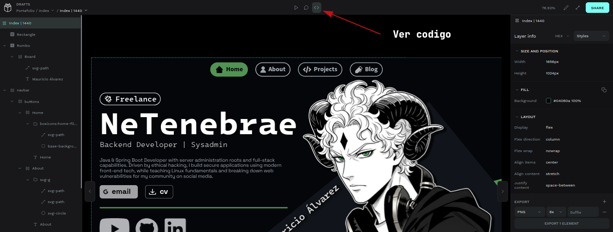

# Prototipado de Portafolio | PROPUESTA #01

## [CHECA EL INDEX](https://design.penpot.app/#/view?file-id=9529fedc-e097-80ce-8008-64cea048fef8&page-id=913d4a22-ba3f-8112-8008-613dd747e4b8&section=interactions&index=0&share-id=d390ec3b-f0b3-80cd-8008-64d06ed9c15c)

> Por el momento, el portafolio **solo cuenta  con el index**. Sin embargo, también encontrarás las referencias y mis proyectos personales en los cuales me basé para la realización de este trabajo.

## Resumen
Este repositorio contiene la **propuesta** de diseño para el portafolio personal en base a **mis proyectos y trabajos anteriores**. 

El proyecto está preparado para que puedas consultarlo de **dos formas distintas**: 
1. [Mediante acceso directo en la nube](https://design.penpot.app/#/view?file-id=9529fedc-e097-80ce-8008-64cea048fef8&page-id=913d4a22-ba3f-8112-8008-613dd747e4b8&section=interactions&index=0&share-id=d390ec3b-f0b3-80cd-8008-64d06ed9c15c) 

2. Descargando e importando el archivo fuente a la aplicacion desplegada en un entorno local contenerizado con Docker.

### Como inspeccionar (Web y Local)

---
## Opción 1. Visualización Directa Online (Recomendada)

Para revisar el diseño final y probar las interacciones sin necesidad de instalar software adicional. La vista interactiva permite navegar por la estructura de pantallas e inspeccionar propiedades de diseño como fuentes, colores y código CSS generado.

> **Requiere cuenta gratuita de penpot - Se recomienda Google**

* [Acceso directo al prototipo](https://design.penpot.app/#/view?file-id=9529fedc-e097-80ce-8008-64cea048fef8&page-id=913d4a22-ba3f-8112-8008-613dd747e4b8&section=interactions&index=0&share-id=d390ec3b-f0b3-80cd-8008-64d06ed9c15c)

## Opción 2. Despliegue Local con Docker

Si prefieres revisar el proyecto dentro de una instancia propia e independiente de Penpot (Y así aprovechar caracteristica como **generar codigo completamente gratis**), puedes levantar el servidor localmente mediante Docker e importar el [`index.penpot`](https://github.com/MarAlvGEN/portafolio/blob/main/index.penpot). 
> [Más info en la documentación de Penpot](https://help.penpot.app/technical-guide/getting-started/docker/)

---

## ¿Por qué elegí Penpot sobre Figma?

Seleccioné **Penpot** para el diseño de este prototipo por tres razones técnicas y prácticas:

* **Inspección de código libre e ilimitada:** A diferencia de Figma (que restringió su *Dev Mode* tras un muro de pago), Penpot permite inspeccionar/exportar el código HTML, CSS y SVG generado de forma 100% gratuita y sin limitaciones.
* **Terminología nativa de CSS:** En lugar de usar solo términos para diseñadores (como hace Figma para sus botones), Penpot utiliza las propiedades de CSS reales en su UI (por ejemplo, los botones directamente se llaman `align-items` o `justify-content`, ect). Diseñar en Penpot ayuda mucho a entener como se maqueta en CSS.
*  **Rendimiento optimizado y autonomía**: Al poder desplegar Penpot localmente con Docker, la herramienta aprovecha los recursos del sistema sin depender de la velocidad de conexión a internet ni de la carga de servidores de terceros.
