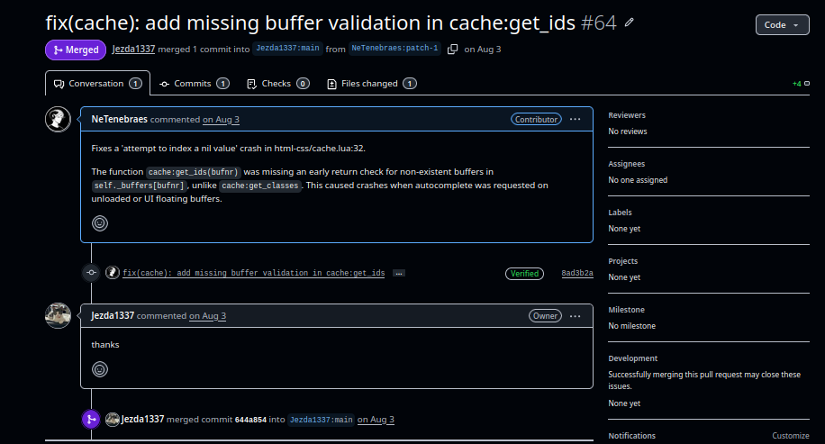

# Bug Bounty Hunter (BugCrowd)

Hunting activo de bug bounties en BugCrowd, identificando y divulgando responsablemente vulnerabilidades.

## Resumen

Hunting activo de bug bounties en BugCrowd, identificando y divulgando responsablemente vulnerabilidades en aplicaciones web y servicios de red.

## Implicaciones

Contribuye a la seguridad de sistemas en producción mientras desarrolla habilidades prácticas de penetration testing y gana reconocimiento en la comunidad de ciberseguridad.

## Desafíos

- Balancear escaneo automatizado con técnicas de testing manual
- Escribir reportes de vulnerabilidad claros y reproducibles que cumplan estándares de divulgación

## Resultados

Identificó y reportó múltiples problemas de seguridad en varios targets, construyendo un historial de divulgación responsable.

## Stack Tecnológico

- Cybersecurity
- Nmap
- Curl
