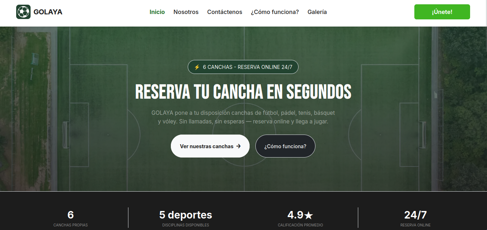
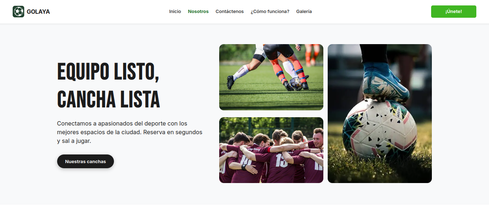
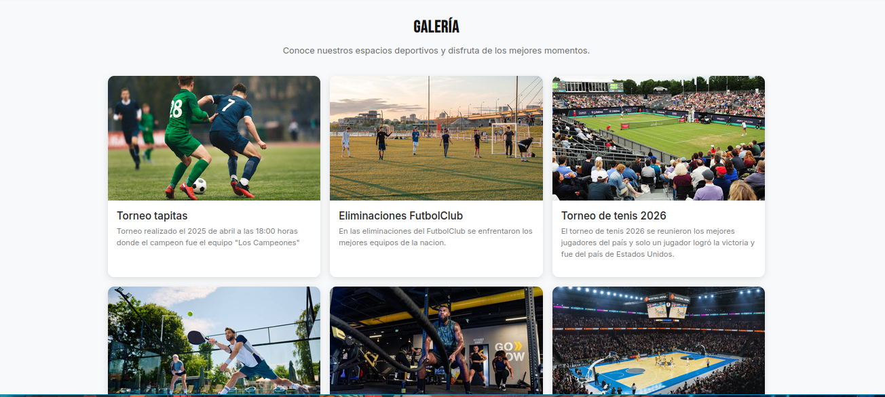

# devPortes

> A full-stack sports complex management and reservation system built from scratch in a team environment.

## Overview

devPortes is a web-based platform that allows users to browse, book, and manage reservations for sports facilities — courts, fields, and courts — in real time. Built as the final project of a software development bootcamp, it demonstrates the ability to deliver a complete product under tight deadlines with a cross-functional team.

The system serves two audiences: **regular users** who book and manage their reservations, and **administrators** who oversee facilities, time slots, and user accounts.

## Key Features

- **Real-time availability** — Users see up-to-date slot availability and can book instantly
- **Admin dashboard** — Full control over facilities, schedules, and user management
- **Role-based access** — Separate interfaces and permissions for users and administrators
- **User profiles** — Personal reservation history, profile management, and notifications
- **Responsive design** — Works seamlessly on desktop and mobile devices

> The project was deployed on GitHub Pages with a fully functional reservation flow and admin panel.

## How It Was Built

The application follows a classic client-server architecture. The frontend handles form validation, dynamic slot rendering, and API communication, while the backend manages authentication, reservation logic, and data persistence.

### Team Workflow

Working in a team of developers required coordinating integrations across modules — reservation logic, admin panel, and user profiles were developed in parallel and merged through Git.

*The development team during a sprint review.*

## App Gallery

*Reservation interface and facility management screens.*

## Tech Stack

| Layer | Technology |
|-------|-----------|
| Frontend | HTML, CSS, JavaScript |
| Backend | JavaScript (Node.js) |
| Database | NoSQL (MongoDB) |
| Deploy | GitHub Pages |

## What I Learned

- **Team coordination** — Managing parallel feature development and merge workflows
- **State management** — Handling reservation state across concurrent users
- **Full-stack integration** — Connecting frontend forms to backend APIs and database operations
- **Agile methodology** — Delivering increments in short sprint cycles
