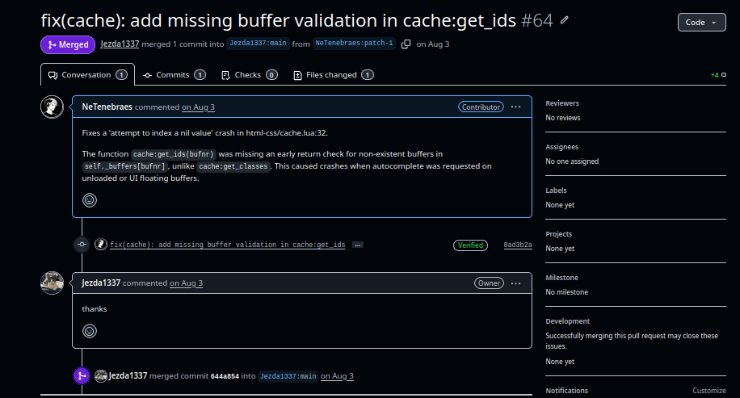

# Intel Legacy Buffer Fix (Arch Linux)

Script de automatización que corrige artefactos de renderizado en GPUs Intel antiguas bajo X11.

## Resumen

Script de automatización que corrige artefactos de renderizado (líneas verticales, corrupción de pantalla) en GPUs Intel antiguas bajo X11, reemplazando Mesa moderna por mesa-amber y habilitando aceleración SNA.

## Implicaciones

Restaura renderizado estable sin tearing en hardware Intel Gen6 (Sandy Bridge) ejecutando Arch Linux con gestores de ventanas ligeros como BSPWM.

## Desafíos

- Manejar conflictos de dependencias de pacman con `-Rdd`
- Mitigar congelamientos en el login de SDDM forzando renderizado por software en el greeter
- Crear overrides de variables de entorno para mantener Mesa Amber activo en apps Qt y Electron

## Resultados

Eliminó tearing y corrupción de pantalla en hardware Intel HD 2000. El script ha sido probado en múltiples instalaciones Arch e incluye backup automático de configs Xorg.

## Stack Tecnológico

- Linux
- Bash
