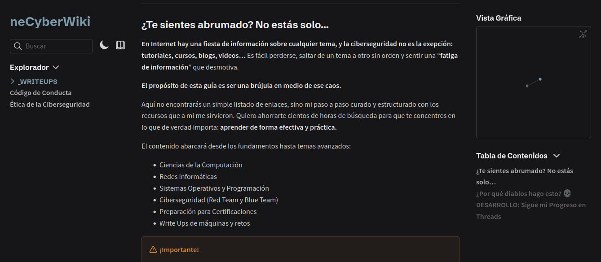

# neCyberWiki

> Wiki colaborativo de ciberseguridad con más de 1800 commits, cubriendo pentesting, hacking ético y fundamentos de ciencias de la computación.

## Resumen

neCyberWiki es un recurso educativo gratuito y open-source que centraliza conocimiento práctico de ciberseguridad en una ubicación accesible. Construido con **Obsidian** para la creación de contenido y publicado vía **Quartz** como sitio estático, conecta la toma de notas personal con el conocimiento público.

La wiki cubre metodologías de pentesting, referencias de herramientas de seguridad, cheatsheets y conceptos fundamentales de ciencias de la computación — todo organizado para consulta rápida durante auditorías de seguridad.

## Qué Contiene

- **Guías de Pentesting** — Metodologías paso a paso para vectores de ataque comunes
- **Cheatsheets** — Tarjetas de referencia rápida para herramientas como Nmap, Burp Suite y Metasploit
- **Referencias de Herramientas** — Guías de uso detalladas para herramientas de auditoría de seguridad
- **Fundamentos de CS** — Networking, criptografía y conceptos de sistemas operativos
- **Configuraciones Custom** — Templates de Obsidian y plugins de Quartz para gestión de conocimiento

*Estructura y organización del contenido del wiki.*

## Stack Tecnológico

| Capa | Tecnología |
|------|-----------|
| Contenido | Obsidian (Markdown) |
| Publicación | Quartz (generador de sites estáticos) |
| Control de versiones | Git |
| Hosting | GitHub Pages |

## Impacto

> 9 estrellas en GitHub, licenciado bajo MIT, con más de 1800 commits de conocimiento de seguridad curado.

El proyecto está publicado en [netenebraes.github.io/neCyberWiki](https://netenebraes.github.io/neCyberWiki/) y recibe contribuciones de la comunidad.

## Lo Que Aprendí

- **Arquitectura de contenido** — Organizar más de 1800 notas en una estructura de conocimiento navegable y mantenible
- **Generación de sites estáticos** — Configurar Quartz para renderizar Markdown con formato de Obsidian correctamente
- **Disciplina de documentación** — Mantener calidad y consistencia del contenido en un repositorio grande y en evolución
- **Flujo de trabajo open source** — Gestionar issues, pull requests y contribuciones de la comunidad
