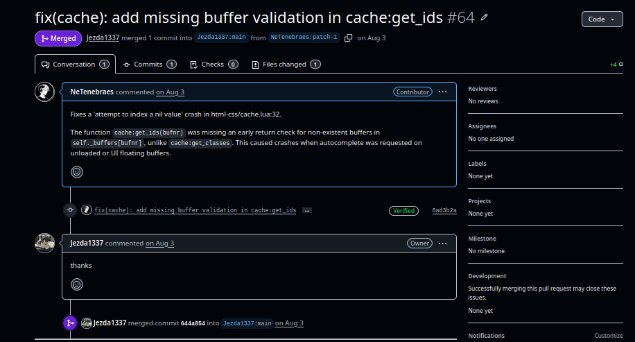

# neCyberWiki

Wiki de conocimiento colaborativo sobre ciberseguridad, hacking ético y ciencias de la computación.

## Resumen

Wiki de conocimiento colaborativo sobre ciberseguridad, hacking ético y ciencias de la computación, construida con Obsidian y publicada vía Quartz. Incluye guías de pentesting, cheatsheets y referencias de herramientas.

## Implicaciones

Proporciona un recurso educativo gratuito y open-source que centraliza conocimiento práctico de seguridad en una ubicación accesible.

## Desafíos

- Mantener calidad del contenido a través de 1800+ commits mientras se sincroniza el generador de sites estáticos Quartz con las convenciones de markdown de Obsidian.

## Resultados

Publicado en [netenebraes.github.io/neCyberWiki](https://netenebraes.github.io/neCyberWiki/) con 9 estrellas. Licenciado bajo MIT con contribuciones de la comunidad bienvenidas.

## Stack Tecnológico

- Cybersecurity
- Git
