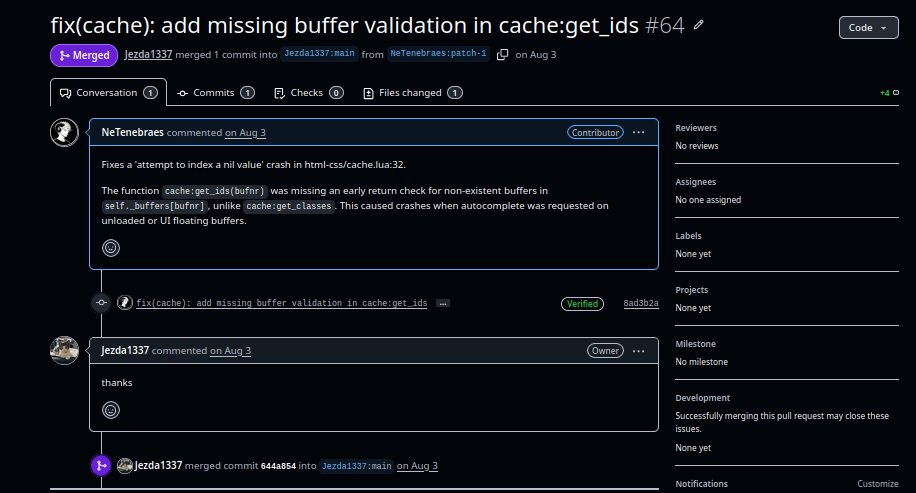

# nenvim

Modular Neovim configuration written in Lua, focused on maintainability and a clean development workflow.

## Overview

Modular Neovim configuration written in Lua, focused on maintainability and a clean development workflow with curated plugins for LSP, linting, formatting, and UI.

## Implications

Provides a reproducible, version-controlled editor setup that can be cloned and restored in minutes on any fresh Arch install.

## Challenges

- Balancing plugin load times with feature richness required careful lazy-loading via Mason
- Selective keymap definitions to avoid conflicts between plugins

## Results

Maintains a modular directory structure (`config/`, `plugins/`, `theme/`) with pre-configured LSP support and a consistent Catppuccin Mocha aesthetic.

## Tech Stack

- Lua
- Git
