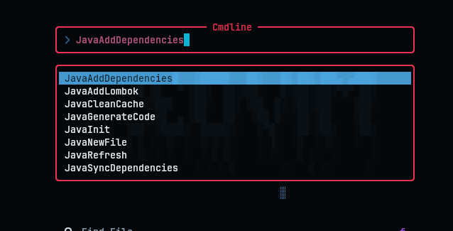
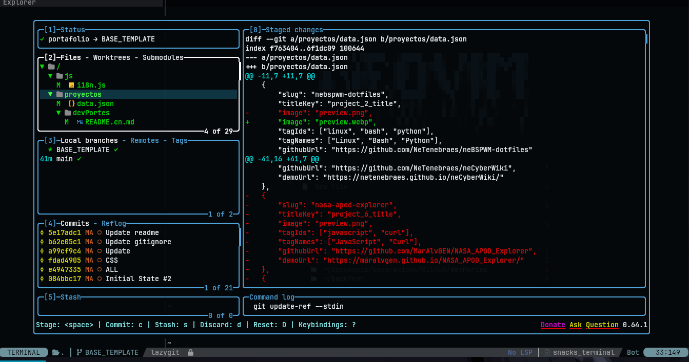

# nenvim

> A production-ready Neovim 0.12 IDE for Java and multi-language development — with a custom plugin manager, two original plugins, and full debugging support.

## Overview

nenvim is not a "Neovim config" — it's a complete development environment built from scratch on **Neovim 0.12** using its native APIs. It features a **custom plugin manager** (vimpack), **two original plugins** (trident and nepost), **deep Java tooling** with 10+ custom commands, and **full DAP debugging** across 5 languages.

Designed for developers who want the speed and extensibility of Neovim with the power of a full IDE, without Electron overhead.

## What Makes This Different

| Feature | Detail |
|---------|--------|
| **vimpack** | Custom plugin manager built on Neovim 0.12's native `vim.pack` API — async parallel updates, floating progress UI |
| **Trident** | Original code search/edit tool with ripgrep, floating editor, and live rename |
| **Nepost** | Original HTTP client (Postman for Neovim) with environments, history, and collections |
| **Native LSP** | Uses `vim.lsp.config()` + `vim.lsp.enable()` — the modern Neovim 0.12 API |
| **dark_cyan** | Custom hand-crafted theme with per-component highlight groups |
| **Format-on-save** | Conform.nvim with Prettier, StyLua, shfmt, google-java-format, and more |

## Java IDE

The Java setup is the most developed part of this configuration — approximately 1500 lines of custom Lua code covering project creation, dependency management, code generation, and build tool integration.

*Java development commands available directly from Neovim.*

### Commands

| Command | Description |
|---------|-------------|
| `:JavaInit` | Interactive project scaffolding — Pure Java, Maven, Gradle, or Spring Boot (downloads from start.spring.io) |
| `:JavaNewFile` | Create Class, Interface, Enum, Record, or Annotation |
| `:JavaAddDependencies` | Add Maven/Gradle dependencies — 40+ curated libraries, Maven Central search, Spring Boot starters |
| `:JavaGenerateCode` | Generate override methods, constructors, toString(), hashCode()/equals(), organize imports |
| `:JavaAddLombok` | Add Lombok annotations (@Data, @Builder, @Slf4j, etc.) |
| `:JavaSyncDependencies` | Run `mvn dependency:resolve` or `gradle dependencies --refresh` |
| `:JavaRefresh` | Refresh JDTLS workspace + rebuild |
| `:JavaCleanCache` | Delete JDTLS workspace cache |

### How JDTLS Works

- **Auto-starts** on `FileType java` — no manual configuration needed
- **Java version detection** from `.java-version`, `pom.xml`, or `build.gradle`
- **Lombok auto-download** — attaches as `-javaagent` automatically
- **Build tool detection** — Maven and Gradle supported with intelligent XML/DSL injection
- **DAP integration** — Java debugging with hot code replace

## Multi-Language Support

| Language | LSP Servers | Formatters | Linters |
|----------|------------|------------|---------|
| Java / Spring Boot | JDTLS + Spring Boot LS | google-java-format | — |
| JavaScript / TypeScript | vtsls | Prettier | oxlint |
| Python | basedpyright + ruff | isort + black | ruff |
| C/C++ | clangd | clang-format | — |
| Bash | bash-language-server | shfmt | shellcheck |
| Lua | lua_ls | StyLua | — |
| SQL | postgres-ls, sqlls | sqlfluff | — |
| HTML/CSS | html, cssls, tailwindcss, emmet | Prettier | markuplint, stylelint |
| Markdown | marksman | mdformat | markdownlint |

## Debugging (DAP)

Full Debug Adapter Protocol support with language-specific runners that execute in Kitty terminal:

| Language | Adapter | Runner |
|----------|---------|--------|
| Java | java-debug-adapter | JDTLS DAP + Spring Boot |
| JavaScript/TypeScript | pwa-node | Node.js |
| Python | debugpy | Python |
| Bash | bash-debug-adapter | bash |
| C/C++ | codelldb | Compiled binary |

**Keybindings:** `<leader>db` toggle breakpoint, `<leader>dc` continue, `<leader>do/di/du` step over/into/out, `<leader>dr` toggle REPL.

## Git Integration

Lazygit runs inside a floating Neovim terminal for a complete Git GUI:

*Lazygit running inside Neovim — branches, staging, diffs, and commits without leaving the editor.*

## Code Search — Trident

A custom search tool built on ripgrep, entirely developed for this config:

- **Search modes:** All files, current file only, exclude current file, exclude current extension
- **Floating editor:** Opens matched files at exact line/column with syntax highlighting
- **Live rename (`T:`):** Floating input with real-time buffer-wide replacement
- **Unsaved changes dialog:** Custom floating modal before closing modified buffers

## HTTP Client — Nepost

A Postman-like HTTP client built entirely in Lua:

- **Request builder:** Method + URL + headers + body in split windows
- **Response viewer:** Status code, headers, formatted body
- **History:** Persistent request history (`:NepostHistory`)
- **Environments:** Switch between dev/staging/prod (`:NepostEnv`)
- **Collections:** Browse saved requests (`:NepostCollections`)

## Live Server

Vite dev server integration with smart features:

- **Multi-project:** Tracks servers per project directory
- **Auto-port:** Finds next available port from 8181
- **Statusline:** Shows `VITE:<port>` when server is running
- **Auto-open:** Opens browser when ready

## Formatting & Linting

**Format-on-save** enabled via conform.nvim:

| Language | Formatter |
|----------|-----------|
| JS/TS/HTML/CSS/JSON/YAML/Vue/Svelte/Astro | Prettier |
| Lua | StyLua |
| Shell | shfmt (4-space indent) |
| Java | google-java-format |
| Python | isort + black |
| SQL | sqlfluff (Postgres dialect) |
| Markdown | mdformat |

**Linting** via nvim-lint: oxlint (JS/TS), stylelint (CSS), markuplint (HTML), markdownlint (Markdown).

## What's Inside

| Component | Plugin |
|-----------|--------|
| Plugin Manager | vimpack (custom, native `vim.pack`) |
| LSP | nvim-lspconfig, mason.nvim, mason-tool-installer |
| Completion | nvim-cmp, LuaSnip, friendly-snippets |
| Java | nvim-jdtls + 10 custom commands |
| Debugging | nvim-dap, nvim-dap-ui, mason-nvim-dap |
| Treesitter | nvim-treesitter (30+ parsers), context, autotag |
| Search | Flash.nvim, Trident (custom) |
| HTTP | Nepost (custom) |
| UI | lualine, bufferline, noice, gitsigns, devicons, render-markdown |
| Editing | mini.nvim (surround, ai, comment, pairs, move), vim-visual-multi |
| Navigation | Snacks.nvim (dashboard, explorer, picker, terminal, zen, lazygit) |
| Formatting | conform.nvim |
| Linting | nvim-lint |
| Theme | dark_cyan (custom) |

## Tech Stack

| Layer | Technology |
|-------|-----------|
| Editor | Neovim 0.12 |
| Config | Lua |
| Plugin Manager | vimpack (custom) |
| LSP | vim.lsp.config() (native API) |
| Java | nvim-jdtls + custom commands |
| Debugging | nvim-dap + 5 language adapters |
| Search | Trident (custom), Flash.nvim |
| HTTP | Nepost (custom) |
| Formatting | conform.nvim |
| Treesitter | nvim-treesitter |
| Theme | dark_cyan (custom) |

## What I Learned

- **Neovim internals** — autocommands, Lua config, native `vim.pack` and `vim.lsp` APIs
- **LSP architecture** — how language servers communicate with editors and how to extend them
- **Java tooling** — integrating Maven/Gradle pipelines, JDTLS configuration, and DAP debugging
- **Plugin development** — building trident and nepost as reusable modules
- **Performance optimization** — lazy-loading, async operations, startup time minimization
